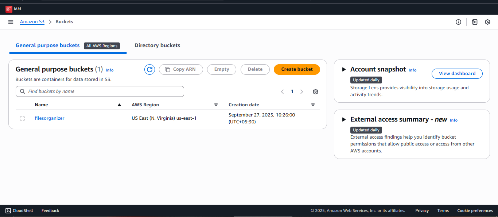
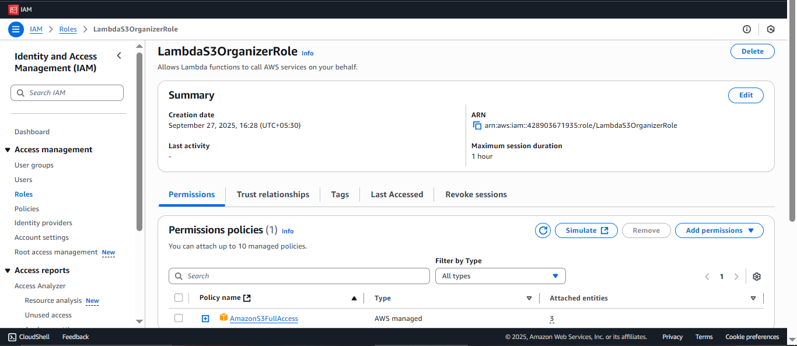
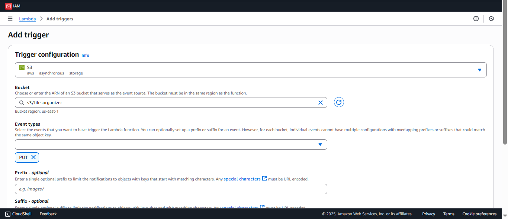
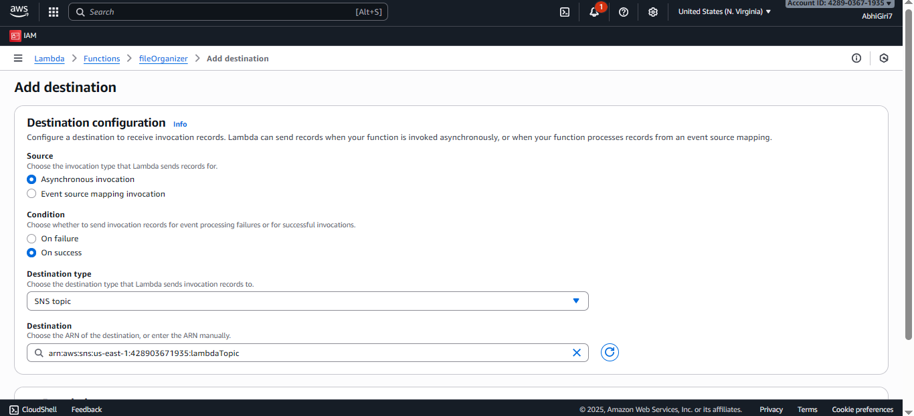
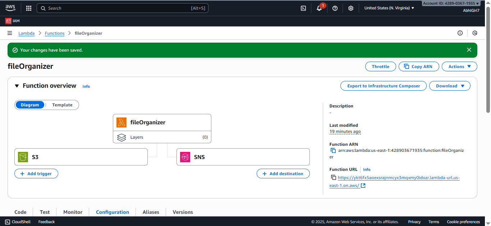
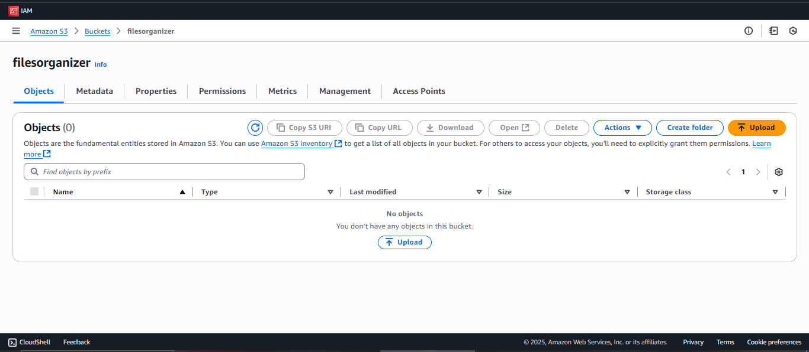
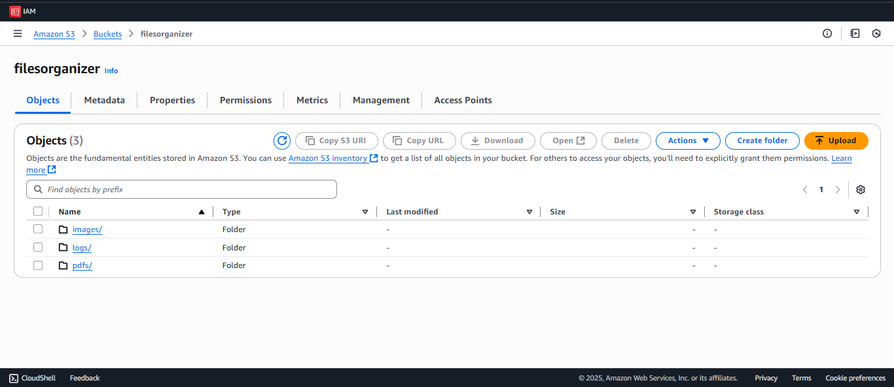
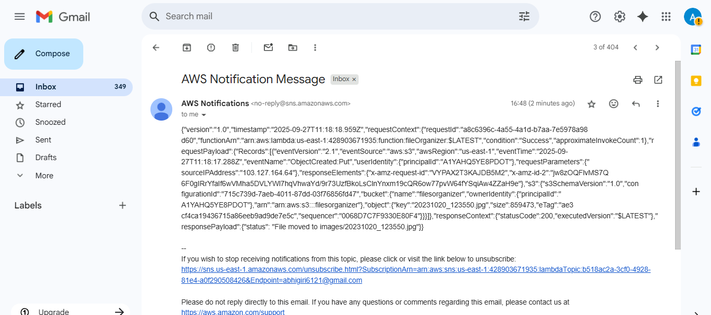

# 📂 Automatic File Organizer with AWS Lambda & SNS

## 🚀 Project Overview
This project demonstrates a **serverless file management system** built on AWS.  
Whenever a user uploads a file to an **S3 bucket**, an **AWS Lambda function** is triggered.  
The Lambda function:
1. Detects the file type (e.g., image, PDF, log, text, etc.)
2. Moves it to the correct folder inside the bucket (`images/`, `pdfs/`, `logs/`, `others/`)
3. Sends an **SNS notification** (email or SMS) to inform the user/admin about the organized file.

---

## ⚙️ AWS Services Used
- **Amazon S3** → File storage and event trigger source  
- **AWS Lambda** → Organizes files by type  
- **Amazon SNS** → Sends notifications to subscribers (Email/SMS/Slack)  
- **IAM** → Grants Lambda permission to access S3 and SNS  
- **CloudWatch** → Monitors logs and execution.

---
## 📂 Project Workflow
1. User uploads a file (`photo.jpg`, `report.pdf`, `error.log`) to S3 bucket.  
2. S3 generates an **event notification** that triggers the Lambda function.  
3. Lambda:
   - Checks the file extension.  
   - Moves the file into the correct folder (`images/`, `pdfs/`, `logs/`, or `others/`).  
   - Publishes a notification to an **SNS Topic**.  
4. SNS sends an **email/SMS** to subscribers with file details.  

## 🖥️ Implementation Steps

### 1. Create an S3 Bucket
Go to AWS S3 → Create bucket → Example: `fileorganizer`.


---
### 2. Create an SNS Topic
- Go to **SNS → Create topic → Standard → Name: FileOrganizerNotifications**  
- Create a **subscription** (Email or SMS).  
- Confirm subscription (via email link).  

---
### 3. Create IAM Role for Lambda
- Attach policies:  
  - `AmazonS3FullAccess`  
  - `AmazonSNSFullAccess`  



---

### 4. Create Lambda Function
- Runtime: **Python 3.11**  
- Add **S3 trigger** for `PUT` event (file upload).  
- Attach IAM role with S3 + SNS access.  



---
### 5. Lambda Code (Python)
```python
import boto3
import os

s3 = boto3.client('s3')
sns = boto3.client('sns')

SNS_TOPIC_ARN = "arn:aws:sns:us-east-1:123456789012:FileOrganizerNotifications"

FOLDER_MAP = {
    'images': ['.jpg', '.jpeg', '.png', '.gif'],
    'pdfs': ['.pdf'],
    'logs': ['.log', '.txt'],
}

def lambda_handler(event, context):
    bucket = event['Records'][0]['s3']['bucket']['name']
    key = event['Records'][0]['s3']['object']['key']
    
    if '/' in key:  # Skip if already inside a folder
        return {'status': 'File already organized'}
    
    file_ext = os.path.splitext(key)[1].lower()
    folder = 'others'
    
    for f, exts in FOLDER_MAP.items():
        if file_ext in exts:
            folder = f
            break
    
    new_key = f"{folder}/{key}"
    
    # Copy to new folder
    s3.copy_object(Bucket=bucket, CopySource={'Bucket': bucket, 'Key': key}, Key=new_key)
    
    # Delete original
    s3.delete_object(Bucket=bucket, Key=key)
    
    # Send SNS notification
    message = f"File '{key}' has been organized into folder '{folder}' in bucket '{bucket}'."
    sns.publish(
        TopicArn=SNS_TOPIC_ARN,
        Message=message,
        Subject="S3 File Organized Notification"
    )
    
    return {'status': f'File moved to {new_key} and notification sent'}

 ```
 ---
### 🔔 Adding an SNS Destination to Lambda

- **Source:** Asynchronous invocation  
- **Condition:** On success  
- **Destination type:** SNS topic  
- **Destination ARN:** `Your-SNS-ARN`  




 ---
 ### ✅ Example Run

 - Upload doc.pdf → Lambda moves it to pdfs/doc.pdf → SNS sends email.
 - Upload photo.png → Lambda moves it to images/photo.png → SNS sends email.
 - Upload server.log → Lambda moves it to logs/server.log → SNS sends email.

 ---
### 📤 Output

---
__Function Overview:__



---

 __Empty S3:__



---
__After Files Upload:__


Automatically created folders and moves the file into the correct folder.

---
__Email Notification:__




---
 ### 🔮 Future Enhancements

 - Organize by date-based folders (e.g., images/2025-09-28/).
 - Support more file types (CSV, Excel, video, etc.).
 ---
 ### 🏆 Conclusion

This project shows how AWS S3 + Lambda + SNS can be combined to create a fully automated, serverless file management system.
It’s lightweight, scalable, and a perfect example of cloud automation for real-world use cases.
